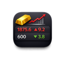
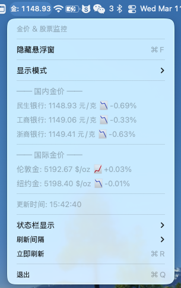
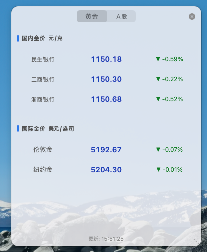
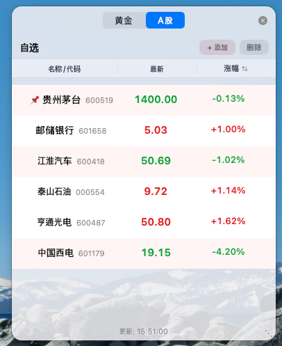
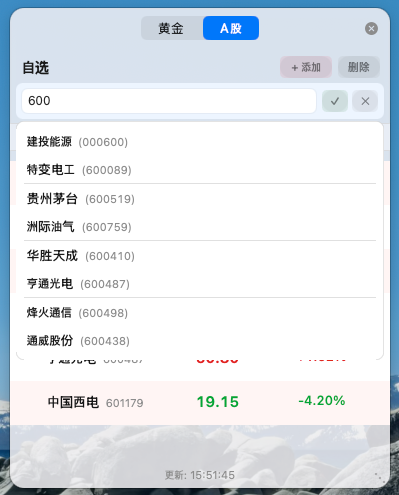

# GoldStock

<p align="center">
  
</p>

<p align="center">
  <b>黄金 & A 股 · macOS 菜单栏</b>
</p>

<p align="center">
  极简 macOS 菜单栏应用：实时监控国内外黄金价格与自选 A 股，本地持久化。
</p>

本项目（**GoldStock**）在 [@PiaoyangGuohai1](https://github.com/PiaoyangGuohai1) 的 [GoldPrice](https://github.com/PiaoyangGuohai1/GoldPrice) 基础上做了扩展：在保留黄金价格监控的同时，增加了 A 股自选列表（添加/删除/置顶、涨跌幅排序、代码与名称搜索）、显示模式与状态栏切换、本地持久化等，并沿用单文件 Swift + AppKit 无第三方依赖的实现方式。

<p align="center">
  
  
  
</p>

## 功能特性

### 黄金
- **国内金价**：民生银行、工商银行、浙商银行（元/克）
- **国际金价**：伦敦金 (XAU)、纽约金 (COMEX)（美元/盎司）
- **涨跌显示**：涨红跌绿，带涨跌幅

### A 股自选
- **自选列表**：添加/删除自选股，支持名称或代码搜索
- **本地持久化**：自选列表保存在本机，重启不丢失（每用户独立）
- **置顶**：右键某只股票可「置顶」——该股在列表中排第一，且可在状态栏显示
- **涨跌幅排序**：表头点击「涨跌幅」可升序/降序/默认顺序

### 通用
- **菜单栏显示**：可切换「显示模式」为「黄金价格」或「A股行情」；状态栏展示对应的一项（金价可选民生/工商/浙商/伦敦/纽约）
- **自动刷新**：支持 3 / 5 / 10 / 30 / 60 秒间隔，可「立即刷新」
- **极简实现**：单文件 Swift，仅用系统 AppKit，无第三方依赖

## 截图

### 菜单栏下拉菜单（menu.png）
点击菜单栏图标后的下拉菜单：可切换显示模式（黄金价格 / A股行情）、查看国内/国际金价、选择状态栏显示项、设置刷新间隔、立即刷新等。

<p align="center">
  
</p>

### 黄金价格（floating-gold.png）
黄金详情界面：国内金价（民生、工商、浙商 元/克）与国际金价（伦敦、纽约 美元/盎司），涨跌红绿显示。

<p align="center">
  
</p>

### A股自选列表（floating-stock.png）
自选股列表：名称、现价、涨跌幅等；支持表头按涨跌幅排序，右键可置顶某只股票（置顶后排在首位并在状态栏显示）。

<p align="center">
  
</p>

### 添加自选股（stock-add.png）
在 A股 界面点击「+ 添加」后，输入股票代码或名称可搜索并选择候选，确认后加入自选列表。

<p align="center">
  
</p>

## 安装

### 方式一：直接下载（推荐）
1. 从本仓库 [Releases](https://github.com/a'di'a/goldstock/releases/latest) 下载 `GoldStock-v1.x.x.zip`
2. 解压后将 `GoldStock.app` 拖入「应用程序」文件夹
3. 首次运行：右键点击 → 打开

### 方式二：从源码编译
```bash
git clone https://github.com/adia1223/goldstock.git
cd goldstock
chmod +x build.sh
./build.sh
open GoldStock.app
```

> `build.sh` 默认优先构建 arm64 + x86_64 Universal Binary；若本机工具链无法交叉编译某一架构，会自动回退为可用的单架构构建。

## 使用说明

1. 启动后菜单栏右侧显示当前选中的金价或自选股（取决于「显示模式」）。
2. 点击菜单栏图标可查看完整金价列表、切换显示模式等。
3. **显示模式**：「黄金价格」时状态栏显示某一只金价；「A股行情」时显示置顶股或第一只自选股。
4. **状态栏显示**：在「状态栏显示」子菜单中可选择在菜单栏展示哪一项（民生/工商/浙商/伦敦/纽约）。
5. **自选股**：在 A股 界面点击「+ 添加」，输入代码或名称搜索后添加；右键某只股票可置顶或取消置顶。

## 首次运行

因应用未经 Apple 签名，首次运行时 macOS 可能会阻止。请：

1. 右键点击 `GoldStock.app`
2. 选择「打开」
3. 在弹窗中再次点击「打开」

或在终端执行：
```bash
xattr -cr /Applications/GoldStock.app
```

## 开机自启动

1. 打开「系统设置」→「通用」→「登录项」
2. 点击「+」添加 `GoldStock.app`

## 数据来源

| 类型 | 来源 | 说明 |
|------|------|------|
| 国内金价 | 京东金融 API | 民生/工商/浙商积存金 |
| 国际金价 | 新浪财经 API | 伦敦金 (XAU)、纽约金 (GC) |
| A 股 | 新浪财经 API | 上海/深圳股票实时行情 |

## 技术栈

| 项目 | 说明 |
|------|------|
| 语言 | Swift 5.9 |
| 框架 | AppKit (原生 macOS) |
| 代码量 | 单文件约 2700+ 行 |
| 依赖 | 无 |

## 项目结构

```
GoldStock/
├── Sources/
│   └── main.swift       # 全部源代码
├── Resources/
│   ├── AppIcon.icns     # 应用图标
│   ├── AppIcon.iconset  # 图标源文件
│   └── screenshots/     # 截图
├── Info.plist           # 应用配置
├── Package.swift        # Swift 包描述（供 IDE 索引）
├── build.sh             # 构建脚本
├── run.sh               # 本地运行脚本
├── README.md
├── DEBUG.md             # 本地调试说明
└── .gitignore
```

## 系统兼容性

- **架构**：Apple Silicon (arm64) + Intel (x86_64) Universal Binary
- **系统**：macOS 12.0 (Monterey) 及以上

## 构建要求

- macOS 12.0+
- Xcode Command Line Tools（或完整 Xcode）

## License

MIT License

## 致谢与出处

- 黄金价格与菜单栏基础功能源自 [GoldPrice](https://github.com/PiaoyangGuohai1/GoldPrice)，作者 [@PiaoyangGuohai1](https://github.com/PiaoyangGuohai1)。
- 本仓库（GoldStock）在其基础上增加了 A 股自选、显示模式与状态栏切换、本地持久化等改动。
